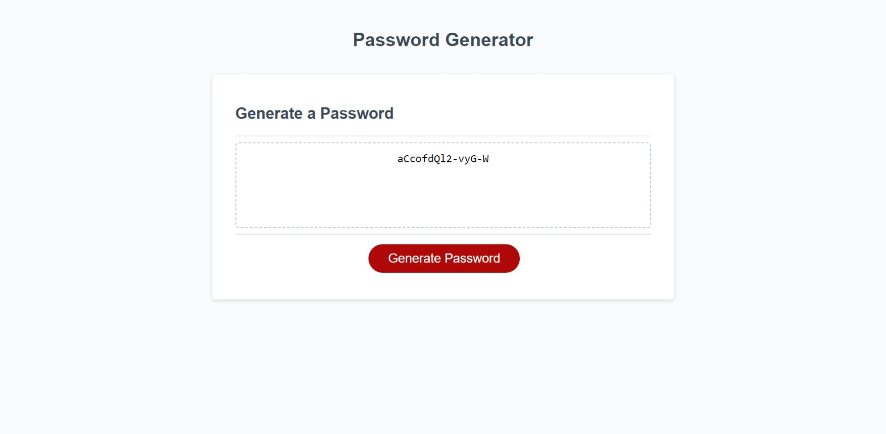

# Password-Generator
Password Generator

## Description

This is a password generator website using JavaScript code to create a password that meets certain criteria from the user input for a strong password for greater security 

## Usage 

- User click the "Generate Password" button
- Then user is prompted to choose a length of at least 8 characters and no more than 128 characters for the password to be generated
- Then user is prompted to confirm if password should contain/include lowercase letters
- Then user is prompted to confirm if password should contain/include uppercase letters
- Then user is prompted to confirm if password should contain/include number characters
- Then user is prompted to confirm if password should contain/include special characters
- After all prompts are confirmed, a password is generated that matches the user selected criterias
- New generated password is displayed/written in the website

## Deployed Website ScreenShot

## Website Link

Follow [Link](https://z20axa.github.io/Password-Generator/)

## Credits

HTML and CSS files provided by UPENN BootCamp Course

